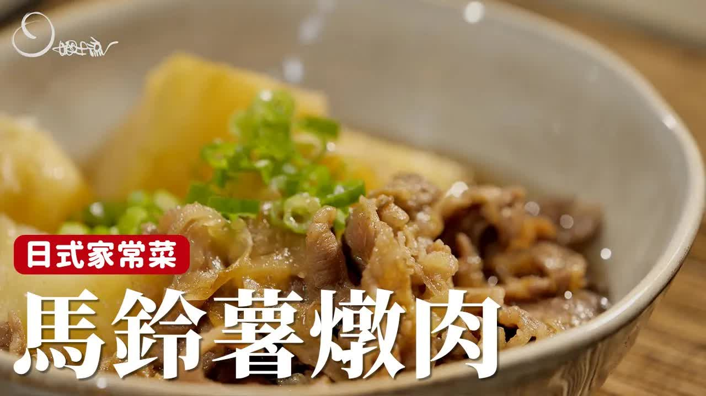

### ✅ **日式馬鈴薯燉肉（Nikujaga）烹飪步驟**

**1. 材料準備：**

* 馬鈴薯：建議切大塊一點，煮起來形狀漂亮不易爛。
* 洋蔥：順紋切絲，有助於炒香不易融爛。
* 牛肉：選用牛小排（油脂豐富），但一般用薄切牛肉也行。
* 調味料：糖、醬油、清酒或味醂、水等。

---

**2. 炒製步驟：**

* **炒洋蔥**：熱鍋加少量油，將洋蔥炒至微焦、呈現咖啡色，釋放甜味。
* **炒牛肉**：加入牛肉，炒至無紅色、油脂釋放出香氣。
* **加糖提味**：牛肉炒好後加糖拌炒。

---

**3. 燉煮階段：**

* **加入馬鈴薯**。
* **加調味液與水**：調味液（如醬油、味醂等）混合後加入，並加水至與食材齊高。
* **使用落蓋（紙蓋）**：用一張剪成鍋子大小的紙蓋（或鋁箔紙）覆蓋食材，使水分循環集中於食材上方，幫助入味。

---

**4. 燉煮時間與火力：**

* **中小火燉煮約 25 分鐘**。
* **煮至馬鈴薯軟透、湯汁收濃**，可用筷子戳馬鈴薯確認是否熟透。

---

**5. 完成與建議食用：**

* 燉到馬鈴薯與肉都軟綿、入味。
* 搭配白飯、小菜（如漬物）、魚或炒青菜即可是一頓日式家庭餐。

---

** 来源 **
+  <https://www.youtube.com/watch?v=1UfWOyM6rNc>
