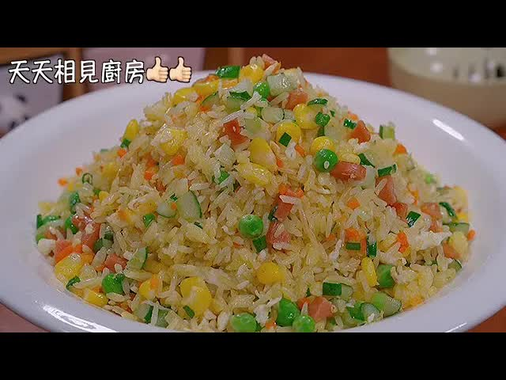

### 🍳【阿剑版蛋炒饭做法总结】

#### 🧾 材料准备：

* 米饭（新鲜煮好，提前搅散）
* 鸡蛋（3个，蛋白蛋黄分开）
* 火腿肠（切丁）
* 黄瓜（去瓤切丁）
* 培根（切小丁）
* 玉米粒（新鲜剥下或罐头）
* 甜豆
* 小葱（切成葱花）

---

#### 🔪 步骤分解：

1. **处理米饭**

   * 将米饭搅散，确保炒的时候不会黏在一起。
   * 米饭推荐用稍硬的，煮时水量少一些以便颗粒分明。

2. **处理鸡蛋**

   * 蛋黄打散后混入米饭中搅拌，使米饭粒粒包裹蛋液。
   * 蛋白单独搅拌备用。

3. **处理辅料**

   * 火腿肠、黄瓜、培根、玉米等全部切丁。
   * 葱切成葱花备用。

4. **焯水食材**

   * 烧水，加盐和油，焯甜豆和玉米粒，煮至浮起后捞出备用。

5. **煸炒辅料**

   * 锅中加油，先炒火腿肠、玉米丁，炒出香味后盛出备用。

6. **炒蛋白**

   * 锅中留底油，小火炒蛋白至凝固，铲成小块。

7. **炒饭**

   * 加入蛋黄拌过的米饭，大火翻炒，使其干爽、分明、不粘锅。

8. **合炒所有配料**

   * 加入炒好的火腿肠、黄瓜丁、焯水蔬菜、培根丁等一起翻炒均匀。

9. **调味**

   * 加少量盐和白胡椒粉调底味（不需重口）。
   * 最后撒入葱花快速翻炒均匀。

10. **出锅装盘**

    * 关火装盘，即可享用。

---

### ✅ 成品特点：

* **色香味俱全**：五彩斑斓、米饭粒粒分明。
* **营养丰富**：蔬菜 + 蛋白 + 主食一锅端。
* **不油腻、孩子爱吃**。

---

** 来源 **
+  <https://www.youtube.com/watch?v=VCELAeG3lyI>
