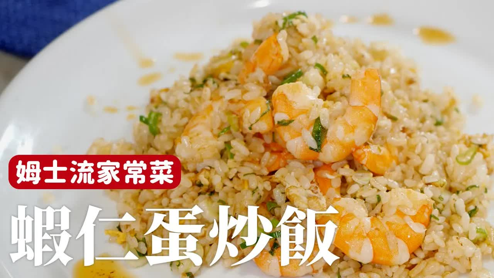

这道炒饭的烹饪步骤可以总结为以下几步：

1. **准备材料：**

   * 蝦子（使用带壳蝦）
   * 蔥、蛋、冷饭
   * 蝦壳（用来做蝦油和蝦湯）

2. **制作蝦油和蝦湯：**

   * 将蝦壳先炒至全熟，直到香味释放，蝦壳变成炸蝦的味道。
   * 将炒熟的蝦壳压碎，加入适量水煮出蝦湯。
   * 过滤掉蝦壳，留下蝦湯用于炒饭。

3. **炒蝦：**

   * 在锅中加油，先炒蝦子，加入少量水和蝦油，让蝦子表面有烙锅的香气。
   * 如果不想麻烦，可以直接跳过这步，直接与蛋一起炒。

4. **炒饭：**

   * 在另一个锅中加入少量蝦油，炒葱，再加入蛋。
   * 加入冷饭，用铲子把饭炒散，使每一粒饭分明且干燥。
   * 逐渐加入蝦湯，使饭粒更具风味，但不一次加入太多，分次加入，确保饭粒吸收足够的湯汁。

5. **调味：**

   * 加入适量盐和蝦汁，根据口味调整。
   * 继续炒至饭粒干爽且吸收足够的蝦味。

6. **完成：**

   * 最后加入一些蝦油，为炒饭增添香味。
   * 炒好的蝦仁炒饭色泽诱人，蝦味十足，外脆内嫩。

这道炒饭的特色在于用蝦油和蝦湯增添了浓郁的蝦味，做出来的炒饭不仅香气扑鼻，而且每一口都能吃到饱满的蝦风味。

---

**来源**
+ <https://www.youtube.com/watch?v=5SuekA2ucsU>

