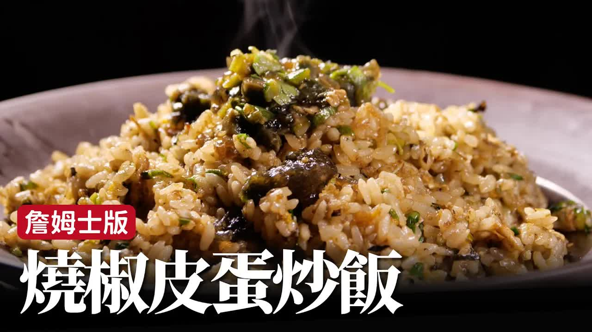

---

### 🔥 **燒焦皮蛋炒飯 - 製作步驟整理**

#### **一、製作皮蛋辣椒醬**

1. **準備辣椒**：

   * 綠辣椒（較辣）2根
   * 糯米椒（不太辣）3根
   * 可用烤、炸、煮等方式處理，這裡採用**炙烤**方式製作焦香味。

2. **烤辣椒**：

   * 烤至表皮焦黑後放入碗中。
   * **覆蓋保鮮膜悶一下**，待皮變軟、有水氣後剝皮（留少許皮增添香味）。

3. **處理皮蛋**：

   * 去殼（可用紙巾或湯匙協助），切碎或壓碎。
   * 加入剝皮後的辣椒、蔥花、花椒油、醬油（或醬油膏）、白胡椒、香油等調味。

4. **完成皮蛋辣椒醬**：

   * 可用來拌麵、火鍋沾醬或炒飯。

---

#### **二、製作炒飯本體**

1. **起鍋燒熱**，下油熱鍋（鑊氣要夠）。
2. **打蛋入鍋**，蛋白蛋黃分離後不要急著翻，讓蛋香先出來。
3. **加入白飯**，與蛋炒散，炒乾水分。
4. **放入蔥花**，提香。
5. **加入皮蛋辣椒醬**（約1匙即可）。
6. **視口味補充調味**：

   * 加醬油提香、鹽補鹹、白胡椒補香（量少即可）。

---

#### ✅ **小提醒**

* **皮蛋的甜味**可替代味精，能提鮮。
* 若覺得炒飯皮蛋味道不夠濃，搭配一點**皮蛋醬拌著吃**，風味會更突出。
* 此皮蛋炒飯的靈魂：**炒飯本體 + 焦香皮蛋辣椒醬的搭配食用**。

---

**来源**
+ <https://www.youtube.com/watch?v=kItDG3GaLSk>

