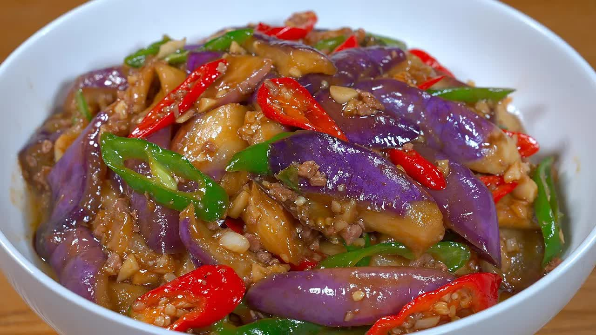

这道菜是“家常红烧茄子”，特点是不炸不油腻、做法简单、非常下饭。以下是烹饪的**简要步骤总结**：

---

### 🍆 一、准备食材

* **茄子**数根（紫皮，8毛钱一斤）
* **瘦肉**适量，剁成肉末
* **青龙椒**切斜片
* **蒜子**拍碎切末

---

### 🧂 二、处理茄子

1. **清洗**：用淡盐水将茄子洗净表皮
2. **切块**：去蒂，切滚刀块
3. **腌制**：加食盐和白醋拌匀，腌制10分钟
4. **去水**：腌好后洗净盐分，挤干水分（越干越好）

---

### 🍳 三、调酱料汁

调料碗中加入：

* 食盐
* 蒜蓉鲜（调味料）
* 胡椒粉
* 白糖
* 老抽、生抽
* 食用油
  搅拌均匀备用

另备水淀粉（玉米淀粉 + 清水）

---

### 🔥 四、分步骤炒制

1. **炒茄子**：锅中热油，放入茄子炒软、炒至变色，盛出备用
2. **炒肉末**：锅留底油，加入肉末和蒜末，炒至肉变色、出香味
3. **调味收汁**：加入青椒片、调好的料汁，大火翻炒烧开
4. **混合茄子**：放回炒好的茄子，继续翻炒均匀
5. **勾芡收汁**：加入水淀粉翻炒至汤汁包裹茄子即可

---

### 🍽 五、装盘享用

盛入碗中，酱香浓郁、软嫩入味，堪比红烧肉，非常下饭！

---

**来源**
+ <https://www.youtube.com/watch?v=x6Uit9bmN-g>

