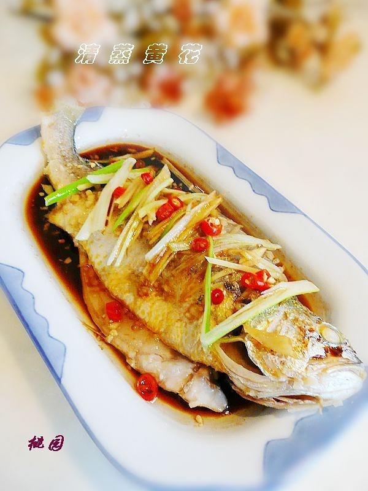

---

### ✅ 材料准备：

* 黄花鱼 1 条
* 蒜 3\~4 瓣（切蓉）
* 葱、姜（切丝）
* 小指椒 2\~3 个（切粒）
* 蒸鱼豉油 2 汤勺（可用李锦记）
* 料酒 1 茶勺
* 盐 适量
* 热油 1\~2 汤勺

---

### 🍽️ 做法步骤：

1. **处理鱼身**
   黄花鱼去鳞、内脏、鳃，冲洗干净，控干水分；鱼身两侧每隔半厘米切斜刀。

2. **腌制去腥**
   蒜蓉加盐拌匀，抹在鱼身及刀口处，腌制 20 分钟。

3. **准备蒸制**
   鱼身铺上葱姜丝，淋料酒；将鱼放入蒸锅，同时放一小碗蒸鱼豉油。

4. **蒸鱼**
   水开后上锅，大火蒸 8 分钟，转小火虚蒸 2\~3 分钟；取出鱼，去掉葱姜。

5. **调味提香**
   鱼身撒上新切葱姜丝与小指椒粒，淋上热好的蒸鱼豉油；再浇一勺烧至八九成热的热油提香。

---

**来源**
+ <https://www.xiachufang.com/recipe/128601/>
---
