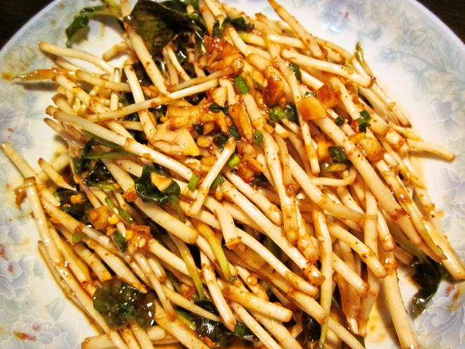

---

### ✅ 材料准备：

* 折耳根（洗净去泥）
* 蒜泥
* 姜末
* 葱花
* 生抽、醋、香油、花椒油、油辣椒
* 盐（适量）

---

### 🥗 做法步骤：

1. **清洗折耳根**
   多次清洗去泥沙，用冷水浸泡 10 分钟，控干水分备用。

2. **准备调料**
   切好姜末、蒜泥，葱切葱花。

3. **调拌入味**
   将折耳根放入大碗中，加入盐、姜末、蒜泥、生抽、醋、香油、花椒油、油辣椒拌匀。

4. **装盘享用**
   撒上葱花，即可食用，酸辣脆爽，开胃解腻。

---

**来源**
+ <https://www.xiachufang.com/recipe/1012651/>
