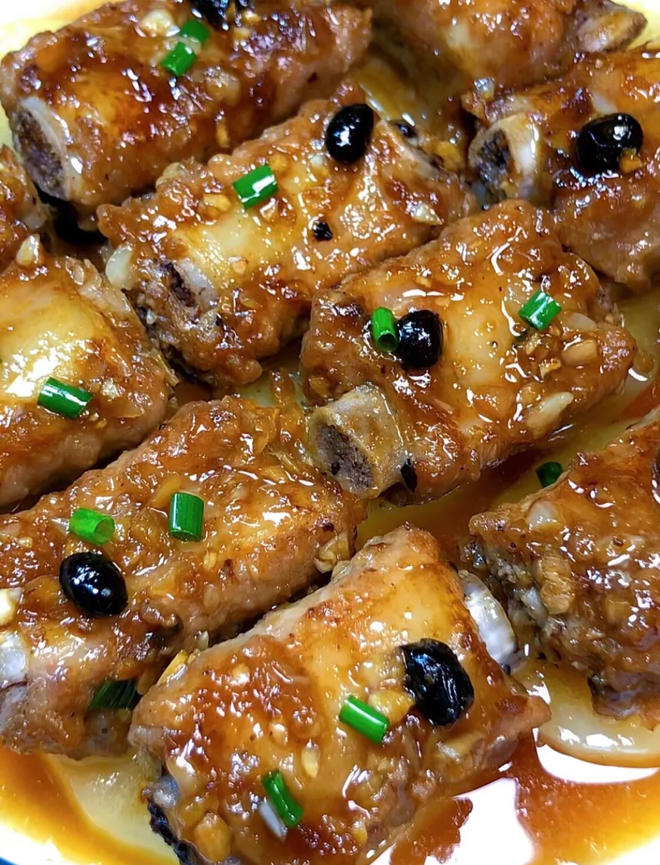

当然，以下是**广式豆豉蒸排骨**的简明烹饪步骤总结：

---

### ✅ 材料准备：

* 猪肋排 500 克
* 土豆 1 个（切片）
* 蒜末 2 勺
* 豆豉 半勺
* 生抽 2 勺
* 蚝油 1 勺
* 白糖、盐 少许
* 生粉 1 勺
* 面粉（清洗排骨用）

---

### 🍲 做法步骤：

1. **清洗排骨**
   排骨加面粉和清水反复抓洗 2 分钟，洗出血水和杂质，再用清水冲洗干净，控水备用。

2. **调酱激香**
   碗中放蒜末、豆豉，淋热油激发香味，加入生抽、蚝油、白糖、盐调味，搅匀。

3. **腌制入味**
   将酱料倒入排骨中，加生粉抓拌均匀，腌制约 30 分钟。

4. **准备蒸制**
   蒸盘底铺上土豆片，将腌好的排骨铺在上面。

5. **蒸排骨**
   水开后上锅，大火蒸 25 分钟。

6. **完成享用**
   出锅即可，排骨嫩滑入味，豆豉香浓，土豆也吸足了肉汁，非常下饭！

---

**来源**
+ <https://www.xiachufang.com/recipe/106804588/>
---
