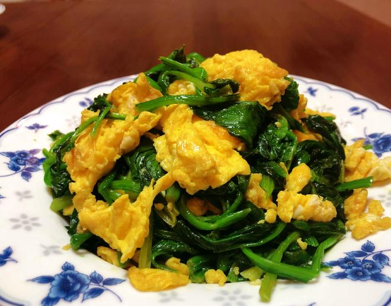

---

### ✅ 材料准备：

* 菠菜 1 把
* 鸡蛋 4 个
* 小葱 适量（切末）
* 盐 半勺
* 食用油 适量

---

### 🍳 做法步骤：

1. **焯菠菜**
   水烧开，加少许盐，焯菠菜至颜色翠绿，捞出过冷水；完全冷却后攥干水分，切几刀备用。

2. **备配料**
   鸡蛋打散，小葱切末。

3. **炒鸡蛋**
   热锅下油，油温八成热时倒入蛋液炒熟，盛出备用。

4. **炒菠菜**
   原锅转小火，爆香葱花，加入菠菜翻炒，炒至略出水。

5. **合炒调味**
   倒入炒好的鸡蛋，加盐，大火快速翻炒均匀即可出锅。

---

**来源**
+ <https://www.xiachufang.com/recipe/106014471/>

