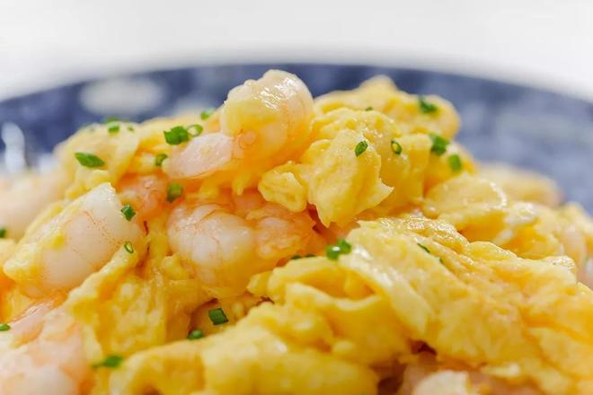

---

### ✅ 材料准备：

* 鸡蛋 4 个
* 虾仁 200 克
* 小葱 适量（切葱花）
* 调料：料酒 2 茶匙、盐 1.5 茶匙、淀粉 2 茶匙（加水调成水淀粉）

---

### 🍳 做法步骤：

1. **处理虾仁**
   虾仁洗净擦干，加 2 茶匙料酒和 1 茶匙盐腌制片刻。

2. **炒虾仁**
   热锅热油，下虾仁大火快炒至变色熟透，连汤带油盛出放凉备用。

3. **调蛋液**
   4 个鸡蛋加入 0.5 茶匙盐打散，不需打太久，蛋白蛋黄混合即可。

4. **混合蛋液**
   将虾仁连汤汁、油、水淀粉一起倒入蛋液中搅拌均匀。

5. **滑蛋炒制**
   热锅多油烧至冒烟后关火，立刻倒入蛋液，用余温快速翻炒，边缘凝固后打散搅拌。

6. **炒至刚熟**
   蛋液无明显流动状态时即可关火出锅，撒上葱花增香。

---

**来源**
+ <https://www.xiachufang.com/recipe/103468406/>

