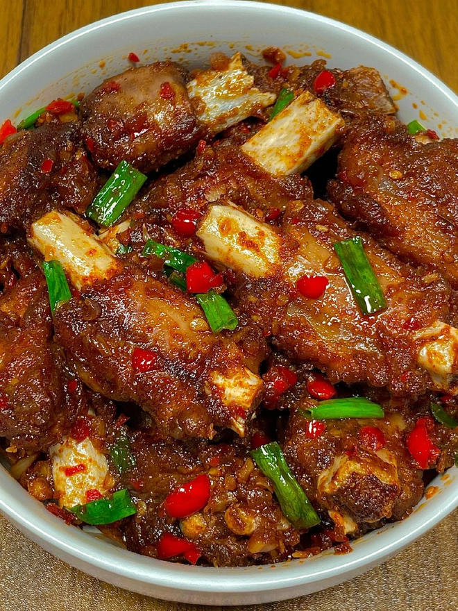

---

### ✅ 材料准备：

* 排骨（适量）
* 洋葱（1个，切碎）
* 蒜末、小米辣、葱段（适量）
* 辣椒粉、孜然粉、烧烤粉（各适量）
* 生抽（2勺）
* 盐、白糖（少许）

---

### 🍳 做法步骤：

1. **焯水煮排骨**
   排骨加葱姜料酒煮至八分熟，捞出沥干。

2. **炸排骨**
   热锅倒油，下排骨炸至表面金黄酥香，捞出备用。

3. **炒香配料**
   锅中留底油，放蒜末、洋葱、小米辣翻炒爆香。

4. **加干料炒香**
   加入辣椒粉、孜然粉、烧烤粉，翻炒均匀。

5. **调味炒制**
   倒入炸好的排骨，加 2 勺生抽，少许盐和白糖翻炒入味。

6. **出锅装盘**
   放入葱段，快速翻炒均匀后出锅即可。

外酥里嫩、香辣孜然味十足，特别适合下饭或当做下酒菜！

---

**来源**
+ <https://www.xiachufang.com/recipe/107245103/>
