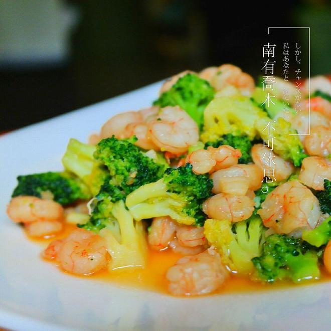

---

这道菜是健康快手菜 **虾仁炒西兰花**，色彩鲜艳、口感清爽，适合日常营养均衡饮食。以下是烹饪步骤总结：

---

### 📝 虾仁炒西兰花：烹饪步骤总结

1. **处理西兰花**
   西兰花洗净，头朝下用淡盐水浸泡 30 分钟，去农残。

2. **处理虾仁**
   虾仁解冻、去虾线，加入酱油和生粉腌制约 10 分钟。

3. **焯西兰花**
   西兰花切小朵，沸水加盐焯水至八成熟，捞出沥干备用。

4. **备料**
   蒜拍碎备用。

5. **炒虾仁**
   热锅少油，下蒜末炒香，加入虾仁翻炒至变色。

6. **合炒出锅**
   加入西兰花翻炒均匀，加少许鸡精和盐调味即可出锅。

7. **装饰点缀（可选）**
   摆盘时可加小番茄点缀，搭配海南辣椒酱食用更有风味。

---

**来源**
+ <https://www.xiachufang.com/recipe/100551182/>

