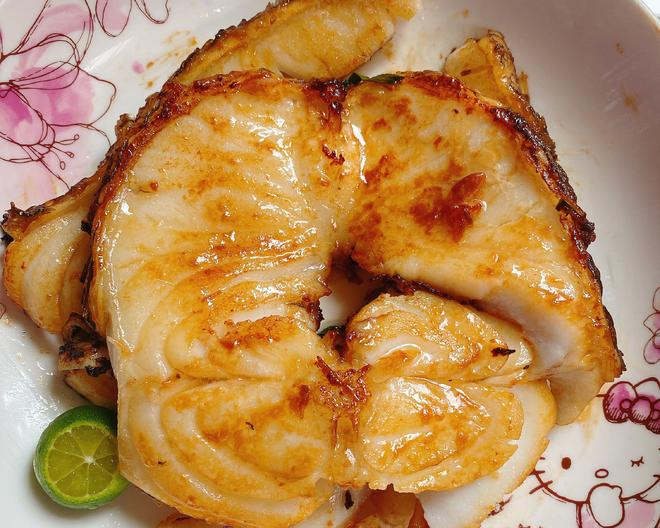

---

以下是这道【香煎银鳕鱼】的简明烹饪步骤总结：

---

### 🐟 香煎银鳕鱼：烹饪步骤总结

1. **准备食材**
   小葱切段，生姜、大蒜切片；银鳕鱼擦干表面水分，鱼皮中间剪一刀防卷曲。

2. **煎鱼**
   热锅融化黄油，放入银鳕鱼煎至两面金黄。

3. **调味煎制**
   加入蚝油、生抽和少量水混合液，再放入葱段、姜片和蒜片，小火煎至汤汁收浓。

4. **出锅装盘**
   汁浓味香，即可出锅享用。

---

**来源**
+ <https://www.xiachufang.com/recipe/104699264/>
