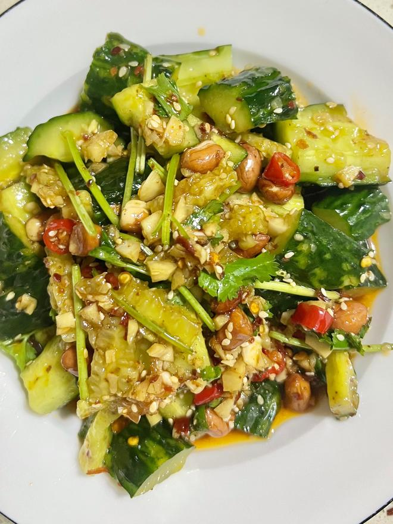

---

1. **准备食材**
   黄瓜洗净拍碎切小块；蒜切末，小米辣切圈，香菜切段，熟芝麻备用。

2. **制作辣油**
   碗中放蒜末、小米辣、熟芝麻、1勺辣椒面，淋入一大勺热油激香。

3. **调配万能汁**
   加入：

   * 生抽 2勺
   * 蚝油 1勺
   * 陈醋 2勺
   * 盐 半勺
   * 糖 少许
   * 香油 少许

4. **拌匀出菜**
   把调料汁和香菜、花生米一起拌入黄瓜中，拌匀即可。

**来源**
+ <https://www.xiachufang.com/recipe/106918418/>
