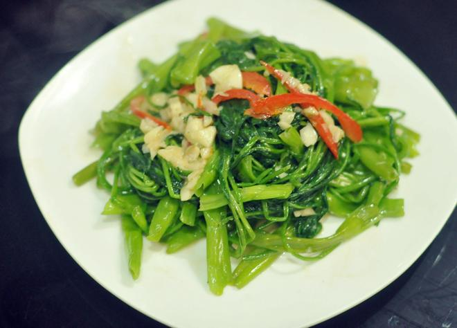

---

### 🌶️ 椒丝腐乳炒空心菜：烹饪步骤总结

1. **准备食材**
   空心菜洗净切段；蒜切蓉，红椒切丝；腐乳与腐乳汁捣成酱。

2. **焯水处理**
   水烧开后加少许油、1茶匙糖、1茶匙盐，下空心菜焯水至断生，捞出备用。

3. **炒香调料**
   热锅下油，炒香蒜蓉、红椒丝和腐乳酱。

4. **合炒空心菜**
   下焯好空心菜，大火翻炒1分钟，加盐调味，淋入少许生粉水勾芡，再加少许花生油炒匀即可出锅。

---

**来源**
+ <https://www.xiachufang.com/recipe/104413738/>
